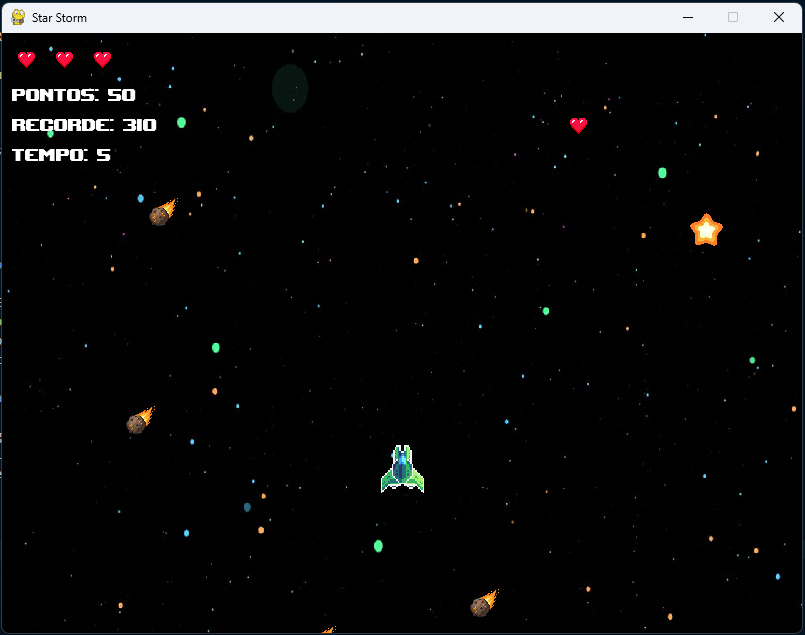

# Star Storm

Projeto final da disciplina de Introdução a Algoritmos/Programação, desenvolvido com Python e Pygame.

Este repositório é um template para os grupos da disciplina. A proposta é começar com uma base funcional e evoluir o jogo ao longo do semestre.

## Integrantes do grupo

- [Aiandra de Sousa Silva](https://github.com/aiandramoraes)
- [Gabriel Vinícius Soares Doti](https://github.com/GabrielDoti)
- [Núbia Torres de Oliveira](https://github.com/nubyoli)

## Estrutura do projeto

- `main.py`: ponto de entrada da aplicação.
- `src/`: código-fonte principal do jogo (loop, regras, sprites e dados).
- `assets/`: imagens, fontes e sons.
- `data/`: arquivos persistentes (recorde/ranking).
- `tests/`: testes unitários com `pytest`.
- `docs/`: documentação do projeto, incluindo proposta inicial.

## Descrição do jogo

Star Storm é um jogo de sobrevivência no espaço em que o jogador controla uma nave e precisa desviar de meteoros.

O jogador começa com 3 vidas e perde 1 vida a cada colisão com um meteoro. A partida termina quando todas as vidas acabam ou quando o jogador coleta uma estrela azul.

A pontuação aumenta conforme o tempo de sobrevivência. Além disso, o jogador pode coletar estrelas amarelas para ganhar pontos extras e itens de power, que podem ajudar com um escudo temporário ou atrapalhar aumentando o tamanho da nave.

Ao final da partida, o jogo exibe a pontuação alcançada e salva um novo recorde caso ele seja superado. 


## Objetivo do jogador

O objetivo do jogador é sobreviver pelo maior tempo possível, desviando dos meteoros e evitando perder todas as vidas. Quanto mais tempo o jogador permanecer vivo, maior será sua pontuação. O jogador também pode aumentar sua pontuação coletando estrelas amarelas e tentando superar o próprio recorde.


## Regras do jogo

- Regra 1: O jogador começa o jogo com 3 vidas.
- Regra 2: Cada colisão com um meteoro reduz 1 vida do jogador.
- Regra 3: Se o jogador zerar as vidas o jogo é encerrado. 
- Regra 4: A cada segundo sobrevivido são somados 10 pontos ao jogador.
- Regra 5: O jogador pode controlar a nave movimentando-a para cima, para baixo, para a esquerda e para a direita.
- Regra 6: Ao coletar uma estrela amarela 100 pontos são somados ao jogador.
- Regra 7: Ao coletar uma estrela azul o jogo é encerrado.
- Regra 8: Ao coletar o elemento de power o jogador pode receber um power up (escudo) ou power down (aumento da nave).

## Controles

Informe as teclas ou comandos utilizados no jogo.

Exemplo:

- Seta para cima (ou W): mover para cima
- Seta para baixo (ou S): mover para baixo
- Seta para esquerda (ou A): mover para esquerda
- Seta para direita (ou D): mover para direita

## Como executar o projeto

### 1. Clonar o repositório

```bash
git clone LINK_DO_REPOSITORIO
cd NOME_DA_PASTA
pip install -r requirements.txt
python main.py
```

## Como executar os testes

```bash
python -m pytest
```

## Checklist mínimo para entrega

- Preencher este README com nome final, descrição real, regras e controles do jogo.
- Atualizar `docs/proposta.MD` com a proposta do grupo.
- Garantir que o jogo executa com `python main.py`.
- Garantir que os testes passam com `pytest`.

## Observações para os alunos

- Mantenham o código organizado em módulos pequenos e com responsabilidade clara.
- Comentem partes importantes da lógica, principalmente regras do jogo.
- Registrem decisões técnicas no README do grupo ao longo do desenvolvimento.

## Jogo Rodando


